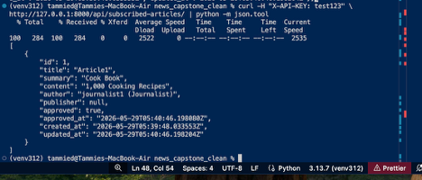
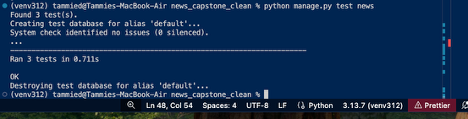
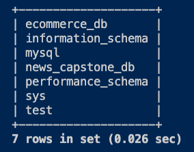

# 📰 News Management System (Capstone Project)

## Repository

GitHub Repository:

https://github.com/Tammied68/news-capstone-project

---

## 📌 Overview

This project is a Django-based News Management System developed as part of a capstone assignment. It demonstrates full-stack software engineering skills including authentication, role-based access control, REST APIs, database management, documentation, version control, and containerization.

The application is a role-based News Publishing Platform built with Django, Django REST Framework, and MariaDB.

The system supports multiple user roles and allows controlled creation, approval, and consumption of news articles.

---

## ✨ Features

### 👥 User Roles

#### Reader

* View approved articles
* Subscribe to publishers
* Subscribe to journalists
* Receive notifications when subscribed content is published

#### Journalist

* Create articles
* Edit articles
* Delete articles
* Publish independently
* Submit articles for editorial approval

#### Editor

* Review pending articles
* Approve submitted articles
* Manage publication workflow

#### Admin

* Full access through Django Admin

---

## 📰 Article Workflow

1. Journalist creates an article.
2. Article is marked as **Pending**.
3. Editor reviews the article.
4. Editor approves the article.
5. Subscribers receive email notifications.
6. Approved articles become visible to readers.
7. Approved articles become available through the REST API.

---

## 🔐 Authentication & Authorization

* Django built-in authentication system
* Username-based authentication
* Custom User Model
* Role-based access control
* Django Groups integration
* Protected views based on user roles

---

## 🌐 REST API

### Endpoint

```text
/api/subscribed-articles/
```

### Authentication

Requests require a valid API key supplied in the request header:

```text
X-API-KEY
```

### Example Request

```bash
curl -H "X-API-KEY: test123" \
http://127.0.0.1:8000/api/subscribed-articles/
```

### Example Response

```json
[
    {
        "id": 1,
        "title": "Article1",
        "summary": "Cook Book",
        "content": "1,000 Cooking Recipes",
        "author": "journalist1 (Journalist)",
        "publisher": null,
        "approved": true
    }
]
```

### API Features

* API key authentication
* Publisher subscription filtering
* Journalist subscription filtering
* JSON serialization
* Third-party client access

---

## 📧 Email Notifications

When an editor approves an article:

1. Subscribers to the article's publisher are identified.
2. Subscribers to the article's author are identified.
3. Email notifications are generated and sent using Django's email framework.

Development email delivery is configured using Django's console email backend.

---

## 🛠️ Tech Stack

* Python
* Django
* Django REST Framework
* MariaDB
* Docker
* Git & GitHub
* Sphinx Documentation
* HTML
* CSS
* Bootstrap

---

## ⚙️ Setup with Virtual Environment

### Clone Repository

```bash
git clone https://github.com/Tammied68/news-capstone-project.git

cd news-capstone-project
```

### Activate Virtual Environment

```bash
source venv312/bin/activate
```

Windows:

```bash
venv312\Scripts\activate
```

### Install Dependencies

```bash
pip install -r requirements.txt
```

### Apply Migrations

```bash
python manage.py migrate
```

### Create Superuser

```bash
python manage.py createsuperuser
```

### Run Server

```bash
python manage.py runserver
```

---

## Database Configuration

This project uses **MariaDB** as the primary database backend.

Database:

```text
news_capstone_db
```

Example Django configuration:

```python
DATABASES = {
    "default": {
        "ENGINE": "django.db.backends.mysql",
        "NAME": "news_capstone_db",
        "USER": "news_user",
        "PASSWORD": "********",
        "HOST": "localhost",
        "PORT": "3306",
    }
}
```

Database verification:

```bash
python manage.py check
```

Output:

```text
System check identified no issues (0 silenced).
```

---

## 🐳 Running with Docker

Build the Docker image:

```bash
docker build -t news_capstone .
```

Run the Docker container:

```bash
docker run --rm -p 8000:8000 news_capstone
```

Access the application:

```text
http://127.0.0.1:8000/
```

---

## 🐳 Docker Verification

Docker containerization was successfully verified.

Verification completed:

* Docker image built successfully
* Django application started successfully inside the container
* System checks completed without errors
* Application was accessible on port 8000

Verification output:

```text
System check identified no issues (0 silenced).
Starting development server at http://0.0.0.0:8000/
```

---

## 📚 Documentation

Project documentation was generated using Sphinx.

To rebuild documentation:

```bash
cd docs
sphinx-apidoc -o source ../
make html
```

Generated documentation:

```text
docs/build/html/
```

---

## 📦 Project Structure

```text
accounts/          Custom user model and roles
news/              Core application logic
news_project/      Django project settings
templates/         HTML templates
docs/              Sphinx documentation
Dockerfile         Container configuration
requirements.txt   Python dependencies
README.md          Project documentation
```

---

## 🧪 API Testing

The REST API was tested using:

* Browser requests
* cURL requests
* Django REST Framework unit tests

### Test Results

```text
Ran 3 tests

OK
```

Tests verify:

* Missing API key handling
* Invalid API key handling
* Successful retrieval of subscribed articles

---

## Screenshots

### REST API Authentication and Successful Response

Demonstrates API key authentication and successful retrieval of approved subscribed articles.



### REST API Unit Tests

Demonstrates successful execution of the Django REST Framework API test suite.



### MariaDB Database Verification

Demonstrates successful MariaDB configuration and creation of the `news_capstone_db` database used by the application.



---

## 🎯 Capstone Requirements Addressed

* Custom User Model
* Role-Based Authentication
* Article Approval Workflow
* Reader Subscriptions
* Email Notifications
* REST API Development
* API Testing
* MariaDB Migration
* Docker Containerization
* Sphinx Documentation
* Git Version Control

---

## 👩‍💻 Author

**Tammie Davis**

University of Chicago | HyperionDev Software Engineering Bootcamp Capstone Project

GitHub Repository:

https://github.com/Tammied68/news-capstone-project
